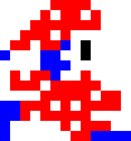
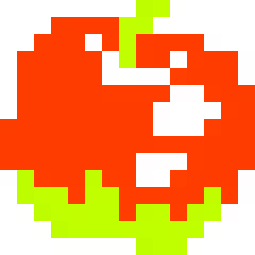
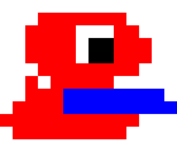
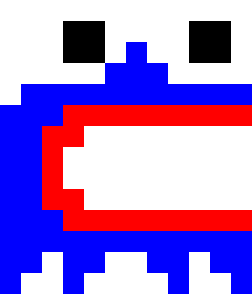

# Mr. Do!

## 0 - Indice
1. [Información general](#1---informaci%C3%B3n-general)
2. [Concepto](#2---concepto)
3. [Mecánicas principales](#3--mec%C3%A1nicas-principales)
4. [Enemigos](#4---enemigos)
5. [Controles](#5---controles)
6. [Condiciones de victoria y derrota](#6---condiciones-de-victoria-y-derrota)
7. [Economía de puntos](#7---econom%C3%ADa-de-puntos)
8. [Niveles](#8---niveles)
9. [Bibliografía](#9---bibliograf%C3%ADa)

## 1 - Información general

- Titulo: Mr. Do
- Género: Arcade / Acción
- Publico objetivo: Jugadores casuales de cualquier edad
- Plataforma: Navegador web (PC)

## 2 - Concepto

Esto es una recreacion de **Mr. Do!**, un juego creado en 1982 por la compañia japonesa Universal Entertainment, en Phaser con fines puramente acádemicos.

En **Mr. Do!** el jugador controla a un payaso cuyo objectivo es aumentar su puntuacion recolectando cerezas mientras se defiende de los diferentes enemigos que recorren los túneles lanzandoles una pelota que rebota por los tuneles hasta que vuelve a Mr. Do o impacta con un enemigo. A parte de la pelota el jugador también tendrá la capacidad de modificar el terreno cavando túneles, lo cual añade una capa táctica para evadir a los enemigos. Se pasa al siguiente nivel cuando: todas las cerezas sean recogidas, todos los enemigos matados, la palabra *EXTRA* deletreada o un diamante encontrado.

Sprite del *Mr. Do*, el personaje controlado por el jugador.

### Loop principal
1. Iniciar partida.
2. Recoger cerezas y matar enemigos.
3. Cumplir cualquiera de los requisitos para pasar de nivel.
4. Repetir hasta que el número de vidas llega a 0.
5. Pantalla con la puntución y vuelta al paso 1.

## 3- Mecánicas principales
### Movimiento
- Movimiento 2D: *Mr. Do* se mueve a velocidad constante en 4 direcciones: arriba, abajo, derecha e izquierda
- Cuando *Mr Do* pasa a traves de una casilla ocupada por tierra el excavará en ella dejando la casilla vacia aunque se verá ligeramente ralentizado.
### Combate
- El **arma principal** de *Mr. Do* es una *power ball* que rebota por los túneles hasta que vuelve a *Mr. Do* o impacta contra un enemigo matándolo.
  - La *power ball* no se podrá lanzar de otra vez hasta que vuelva hasta *Mr. Do* o pase un tiempo determinado tras impactar contra el enemigo. Este tiempo aumenta tras cada nivel dejando a *Mr. Do* indefenso mientras tanto.
    - La fórmula que calcula el tiempo es:
        > Tiempo base (3000ms) + (nivel * 500)
- **Las manzanas**, son objetos repartidos por el mapa en sus posiciones designadas, en un principio estáticos.
  - Estas pueden ser empujados horizontalmente por *Mr. Do*.
  - Si una manzana tiene una casilla vacia debajo suya caera aplastando tanto a *Mr. Do* como los enemigos. Si cae a una altura de por lo menos 2 casillas se romperá.
  - Al romperse existe la pequeña poosibilidad de que deje un *diamante secreto* tras de si.

## 4 - Enemigos
### Mini-Dinos
Es el enemigo más común del juego, recorren los túneles ligeramente mas lentos que Mr. Do y lo matarán al contacto.
- Spawnean al principio de cada ronda de uno en uno cada 2 segundos desde una "madriguera" localizada en el centro del nivel.
  - Spawnean un total entre 6 y 8.
  - Cuando acaban de spawnear todos aparecerá un *bonus item* en lugar de la madriguera que *Mr. Do* podrá coger.
  - De vez en cuando los *Mini-Dinos* entraran en una fase que durará unos pocos segundos donde se moverán más rápido y serán capaces de cavar sus propios túneles.
- Al matar a todos se pasa de nivel.

### Alphamonsters
Este es un enemigo mas raro que aparecerá cuando, o bien, *Mr. Do* consume el *bonus item* o la puntuación adquiera un valor múltiplo de 5000. Estos tienen 5 variaciones idénticas excepto por la letra de la palabra 'EXTRA' que contienen. Cuál variación spawnea se decide dependiendo del indicador en la zona superior del juego.
- Estos actúan igual que los *Mini-Dinos* en su fase normal y mueren al ser golpeados por la bola.
- Al morir:
  - Se convierten en manzanas.
  - El jugador adquiere la palabra que contenían.
- Si son spawneados cogiendo el *bonus item* serán acompañados por 3 *munchers*.

### Muncher
Este enemigo actúa como el *Mini-Dino* en su fase normal. Su particularidad es que puede comer manzanas incluso cuando estas caen sobre este. Obligando a *Mr. Do* a matarlo con la *power ball*.

## 5 - Controles
**Menú**
- WS: Mover la selección en el menú arriba o abajo.
- Z: Confirmar selección.
**Juego**
- WASD: Mover el personaje en una dirección.
- Z: Lanzar pelota.
- X: Pausar / Despausar.

## 6 - Condiciones de victoria y derrota
### Victoria
- Consumir todas las cerezas presentes en el nivel.
- Eliminar a todos los *Mini-Dinos* presentes en el nivel.
- Completar la palabra E-X-T-R-A. -
  -  Al jugador le será ortogada una vida extra.
- Adquirir un *diamante secreto* que las manzanas tienen la pequeña posibilidad de dejar tras de si al romperse.
  - Al jugador le será ortogada una vida extra.
### Derrota
- Se pierde una vida:
  - *Mr. Do* es tocado por un enemigo.
  - Una manza cae sobre *Mr. Do*.
- **Game Over**: Cuando el contador de vidas llega a 0.

## 7 - Economía de puntos
| **Acción**  | **Puntos** |
| ------------- | ------------- |
| Recolectar cereza | 50 pts |
| Recolectar 8 cerezas sequidas | 500 pts |
| Matar un monstruo con la *power ball* | 500 pts |
| Matar 1 monstruo con una manzana | 1000 pts |
| Matar 2 monstruos con una manzana | 2000 pts |
| Matar 3 monstruos con una manzana | 4000 pts |
| Matar 4 monstruos con una manzana | 6000 pts |
| Matar 5+ monstruos con una manzana | 8000 pts |
| Recolectar un *diamante secreto*  | 8000 pts |
| Recolectar *bonus food* | 500 + [Nº de la escena x 500] |

## 8 - Niveles

## 9 - Bibliografía
- [Strategywiki:](https://strategywiki.org/wiki/Mr._Do!) Informacion acerca del juego.
- [The Spriters Resource:](https://www.spriters-resource.com/arcade/mrdo/) Sprites del juego.
